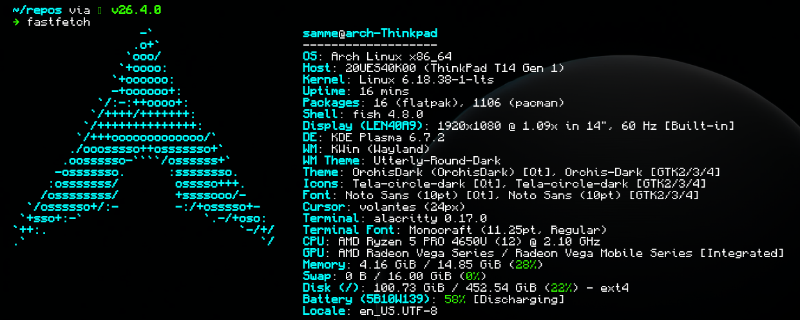

# Personal dotfiles
Linux symlinks managed with [GNU stow](https://www.gnu.org/software/stow/)

## Current main setup
- OS: Arch Linux
- Shell: Fish
- DE: KDE Plasma
- WM: Wayland
- Terminal: Alacritty
- Font: [Monocraft](https://github.com/IdreesInc/Monocraft)

### Extensions/packages
- Starship
- Z tool

## Windows setup
- Windows 10
- Powershell
- Font: [Monocraft](https://github.com/IdreesInc/Monocraft)
